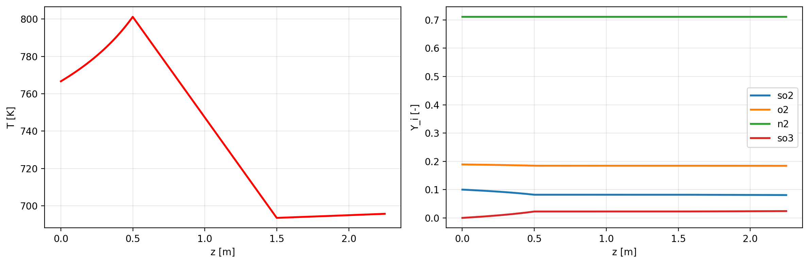
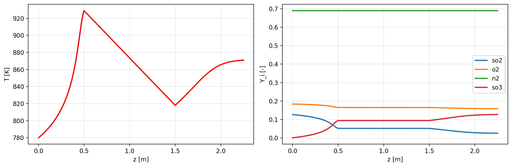

# SO2 Reactor Simulation & PSO Optimization Framework

A YAML-configurable, 1D finite-volume reactor solver for multi-reaction gas-phase chemistry, coupled to a multi-objective Particle Swarm Optimizer (PSO) for design/operating-point optimization. Built around a canonical use case — steady-state SO2 → SO3 conversion in a catalytic reactor — but structured generically enough to support arbitrary species, multi-step reaction networks, and multiple simultaneous optimization objectives.

## Overview

This project simulates a 1D plug-flow reactor with coupled species transport, chemical kinetics, and energy balance, then wraps that simulation in a decomposition-based multi-objective PSO to search reactor design/operating parameters (e.g., inlet composition, inlet temperature) against user-defined objectives (e.g., maximize conversion, minimize temperature drop).

The pipeline is fully YAML-driven: mesh geometry, inlet conditions, species thermodynamics, reaction kinetics, solver numerics, PSO hyperparameters, and plotting options are all defined in config files rather than hardcoded, and a lightweight expression engine allows derived quantities (e.g., normalized mass fractions) to be computed from other config values.

The output of the solver is a set of graphs representing axial distribution of temperature and species in the reactor. Each run produces its own directory as <cases/name_of_run_pso%d>, where the graphs can be accesed. It also produces input and output yaml files, along with a debug file that contains context dictionary of a case. 






## Key Features

- Finite-volume 1D solver with first-order upwind convection, segregated species/temperature equations, and implicit source-term linearization
- Multi-reaction chemistry support with Arrhenius kinetics, reversible reactions via equilibrium constants, and analytical Jacobians for both concentration and temperature sensitivities
- Multi-objective PSO (MOEA/D-style Tchebycheff decomposition) that gracefully degrades to standard global-best PSO for single-objective problems
- YAML-based configuration for mesh, inlet, species, reactions, solver numerics, PSO settings, and plotting — no code changes needed for new studies
- A string-expression engine (`UserExpression`) that resolves derived/interdependent config values and post-simulation outputs
- Automatic per-case artifact generation: YAML snapshots of every case (`caseSetup.yaml`, `reactorDebug.yaml`, `outlet.yaml`) and diagnostic plots (temperature, species, profiles, reaction rates, heat source, concentrations)
## Installation

Clone the repository and set up a Python virtual environment with the required dependencies.

Clone the repository:
```
$bash
$git clone https://github.com/prz3m0k0x/reaction-solver
$cd <repository-folder>
```
Create a virtual environment:
```
python3 -m venv venv
```
Activate it:
```
source venv/bin/activate      # On Linux/macOS
venv\Scripts\activate         # On Windows
```
Upgrade pip and install required packages:
```
pip install --upgrade pip
pip install numpy scipy matplotlib pyyaml
```
You can also use requirements.txt to install dependecies:

```
pip install --upgrade pip
pip install -r requirements.txt 
```

## Repository Structure

```
.
├── main.py                  # Orchestration entry point (config loading → PSO → reactor runs)
├── scripts/
│   ├── solverReactor.py      # Reactor physics: species, reactions, mesh, FV solver, plotting
│   ├── PSOOPtimizer.py       # Multi-objective PSO (Tchebycheff decomposition)
│   └── usrExpr.py            # UserExpression string-expression evaluator
├── config/
│   ├── meshConfig.yaml        # Zone lengths, cell sizing
│   ├── inletConfig.yaml       # Inlet diameter, velocity, temperature, species mass fractions
│   ├── solverNumerics.yaml    # Under-relaxation factors, max iterations, convergence criteria
│   ├── speciesConfig.yaml     # Species thermodynamics + reaction stoichiometry/kinetics
│   ├── psoAlgorithm.yaml      # PSO hyperparameters, optimization parameters/outputs/constraints
│   ├── plottingConfig.yaml    # (optional) plot enable flags, DPI, species subset
│   ├── userExpressions.yaml   # Named expressions resolved against the input context
│   └── outletConfig.yaml      # (optional) named expressions resolved against simulation outputs
└── cases/                    # Auto-generated: one subdirectory per PSO particle evaluation
```

## Architecture

```
config/*.yaml
      │
      ▼
build_context ──► base context (mesh, inlet, solver, chemistry, pso, plotting, expressions)
      │
      ▼
resolve_expressions_in_context ──► fully resolved base context
      │
      ▼
make_pso_config_from_context ──► PSOConfig
      │
      ▼
PSOOptimizer.from_random(pso_cfg, objective_function)
      │
      ├─ for each particle, each iteration:
      │     deep-copy base context → case context
      │     apply_particle_to_context   (write PSO parameters into config)
      │     resolve_expressions_in_context
      │     build_reactor_from_context  ──► solver, species  (solverReactor.py)
      │     solver.initializeCase()
      │     solver.steadyState(...)     ──► converged Outlet
      │     ReactorPlotter               ──► temperature/species/profiles/... PNGs
      │     evaluate_named_expressions  (outlet-derived quantities)
      │     extract_objectives_for_pso  ──► objective vector
      │
      ▼
swarm.global_best_position ──► best particle (optimal reactor parameters)
```

## Module Summaries

### `solverReactor.py` — Reactor Physics Engine

Implements the full physical model as a set of composable dataclasses:

| Class | Responsibility |
|---|---|
| `Specie` | Species thermodynamics (constant or NASA-polynomial heat capacity/enthalpy) |
| `Reaction` | Stoichiometry, Arrhenius kinetics, equilibrium constants, mass-action rates, and analytical Jacobians (concentration & temperature) |
| `Mixture` | Molar mass, ideal-gas density, and mass-weighted heat capacity mixing rules |
| `domainSetup`, `Inlet`, `Outlet` | Geometry and boundary-condition containers |
| `Zone`, `Mesh` | Zone-based 1D mesh generation with per-zone heat/reaction flags |
| `scalarField` | Simple cell-centered field container |
| `solver` | Segregated finite-volume solver: species + energy equations, source-term linearization, `steadyState()` iteration loop |
| `build_reactor_from_context` | Factory that assembles a full `solver` instance from a resolved YAML context, supporting **multiple simultaneous reactions** |
| `ReactorPlotter` | Diagnostic plotting: temperature, species (full or subset), combined profiles, reaction rates, heat source, concentrations |

The solver supports an arbitrary number of reactions per case — each reaction's mass and heat source contributions are accumulated per species/cell before the implicit linear solve.

### `PSOOPtimizer.py` — Multi-Objective Optimizer

A MOEA/D-style Tchebycheff-decomposition Particle Swarm Optimizer:

| Class | Responsibility |
|---|---|
| `PSOConfig` | Hyperparameters, parameter bounds, linear constraints, Das-Dennis weight generation, population sizing |
| `Swarm` | Particle positions/velocities, personal/neighborhood bests, penalty-augmented Tchebycheff scalarization, PSO velocity/position update |
| `HistoryLogger` | Per-iteration logging and `.npy`/`.csv` persistence |
| `PSOOptimizer` | Drives the evaluate → step → update loop; `from_random()` is the typical entry point |

For a single objective (`n_responses == 1`), the algorithm degenerates cleanly to classic global-best PSO.

### `main.py` — Orchestration Pipeline

Loads all YAML configs into a single context, resolves embedded expressions, builds a `PSOConfig`, and defines the PSO `objective_function` closure that:

1. Deep-copies the base context and applies the current particle's parameter values
2. Re-resolves expressions (so derived quantities reflect the new parameters)
3. Builds and runs a full reactor simulation (`build_reactor_from_context` → `steadyState`)
4. Saves per-case YAML snapshots and diagnostic plots
5. Evaluates outlet-derived expressions and extracts the PSO objective vector

### `usrExpr.py` — Expression Engine

Provides `UserExpression`, a small evaluator that parses string expressions from YAML and resolves them against a nested context dictionary, enabling config values (and post-simulation derived outputs) to be defined declaratively rather than hardcoded.

## Configuration Guide

| File | Key Contents |
|---|---|
| `meshConfig.yaml` | `mesh.sizing`, `zones` (per-zone length, type, heat/reaction flags) |
| `inletConfig.yaml` | `diameter`, `inletVelocity`, `inletTemperature`, `speciesYInlet` |
| `solverNumerics.yaml` | `underRelaxationFactors.species`/`temperature`, `maxIter`, `scaledResidual`, `temperatureClipLow`/`High` |
| `speciesConfig.yaml` | `species` (thermodynamics), `reactions` (stoichiometry, exponents, Arrhenius parameters, reversibility), `mixture` (density model) |
| `psoAlgorithm.yaml` | `pso` (hfactor, maxiter, t_neighbors, inertia/cognitive/social schedules), `parameters` (bounds + dotted-path keys), `outputs` (objective keys + goals), `constraints` (optional linear constraints) |
| `plottingConfig.yaml` | `enabled`, per-plot-type flags, `species_subset`, `dpi` |
| `userExpressions.yaml` | Named expressions resolved against the input context |
| `outletConfig.yaml` | Named expressions resolved against simulation outputs (available under `derived` for PSO objectives) |

## Running an Optimization

```bash
python main.py
```

This will:
1. Build and resolve the base configuration from `config/`.
2. Randomly initialize a PSO swarm sized according to `psoAlgorithm.yaml`.
3. Run the full PSO loop, executing one reactor simulation per particle per iteration.
4. Write results for every case under `cases/<study_name><n>/` (`caseSetup.yaml`, `reactorDebug.yaml`, `outlet.yaml`, plus PNG plots).
5. Print the best particle (optimal parameter set) found.

## Known Limitations

- **1D domain only** — no radial or multi-dimensional discretization.
- **First-order upwind convection** — no higher-order convective schemes.
- **Segregated (non-coupled) solver** — species and temperature equations are solved sequentially per outer iteration, requiring careful under-relaxation for stability.
- **Serial PSO evaluation** — each particle's objective function runs a full reactor simulation with no parallelization; runtime scales with `pop_size() × max_iter`.
- **No pressure equation** — density follows the ideal gas law at a fixed reference pressure (low-Mach-number assumption).
- **Strict dotted-path config access** — PSO parameter keys must already exist as placeholders in the base YAML config.
- **Unbounded case directory growth** — every particle evaluation creates a new `cases/` subdirectory; long PSO runs generate many files.
